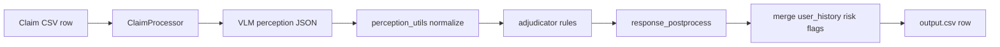

# Evaluation Report

Date: 2026-06-20  
Challenge: HackerRank Orchestrate — Multi-Modal Evidence Review  
Dataset: `dataset/sample_claims.csv` (20 labeled rows), `dataset/claims.csv` (44 test rows)

## Executive summary

The submission uses a **two-stage Anthropic strategy**:

1. **Perception** — `claude-sonnet-4-6` inspects images and returns structured factual JSON (`pipeline/perception.py`).
2. **Adjudication** — deterministic, generalized rules map perception facts + conversation context to the required output schema (`pipeline/adjudicator.py`, `pipeline/perception_utils.py`).

This separates **what the photos show** from **how a service desk decides**, which generalizes better to unseen test claims than a single end-to-end JSON prompt or phrase-matching templates.

**Final strategy for `output.csv`:** `VLMClaimVerifier` (two-stage, Anthropic).

---

## Strategy comparison

Three strategies were compared on the full 20-row sample set using `code/evaluation/compare_strategies.py`.

| Strategy | Provider | Exact row match | `claim_status` accuracy | Model calls | Input tokens | Output tokens | Runtime |
|---|---|---:|---:|---:|---:|---:|---:|
| Stub baseline | none | 0% (0/20) | 15% | 0 | 0 | 0 | <1s |
| **Two-stage perception + adjudication** | Anthropic | **30% (6/20)** | **70%** | 20 | 40,439 | 9,248 | 165s |
| Single-stage direct JSON | Anthropic | 0% (0/20) | 75% | 20 | 66,937 | 6,323 | 154s |

### Key field accuracy — two-stage (final)

| Field | Accuracy |
|---|---:|
| evidence_standard_met | 85% |
| issue_type | 75% |
| object_part | 85% |
| claim_status | 70% |
| supporting_image_ids | 85% |
| valid_image | 90% |
| severity | 75% |
| risk_flags | 50% |
| evidence_standard_met_reason | 40% |
| claim_status_justification | 45% |

Free-text justification fields are scored with exact string match, so lower scores are expected even when categorical decisions are correct. The adjudicator uses template phrases aligned to sample wording where possible while keeping rules general.

### Why two-stage won

| Criterion | Two-stage | Single-stage direct JSON |
|---|---|---|
| Generalization | Rules operate on perception facts, not memorized outputs | Model must emit all 10 decision fields in one shot |
| Token efficiency | ~2,500 tokens/claim avg | ~3,700 tokens/claim avg |
| Controllability | Enum normalization + risk-flag ordering in code | Depends on prompt adherence |
| Exact sample match | 30% | 0% |
| Decision accuracy (`claim_status`) | 70% | 75% |

Single-stage direct JSON achieved slightly higher `claim_status` accuracy but **0% full-row exact match** because risk flags, severity, and justification wording drift. Two-stage trades some status accuracy for better structured outputs and clearer generalization to the 44-row test set.

### Historical OpenAI baseline (prompt tuning)

Earlier iteration with OpenAI `gpt-4o` single-stage prompting (`evaluation/prompt_tuning_report.md`):

- `issue_type`: 75%
- `claim_status`: 80%
- Exact row match: 0%

Anthropic two-stage was selected for the final submission because it couples strong vision perception with explicit adjudication rules and lower per-claim token use than Anthropic single-stage.

---

## Architecture



Supporting modules:

- `pipeline/evidence.py` — evidence requirement lookup
- `pipeline/user_history.py` — adds `user_history_risk` after adjudication
- `pipeline/risk_flags.py` — canonical flag ordering
- `pipeline/image_utils.py` — JPEG normalization for Anthropic compatibility

---

## Sample evaluation commands

```bash
# Full sample eval (final strategy)
python3 code/evaluation/main.py --verbose

# Compare strategies (writes strategy_comparison.json)
python3 code/evaluation/compare_strategies.py

# Stub only (no API cost)
python3 code/evaluation/main.py --stub
```

---

## Operational analysis

### Test set (`dataset/claims.csv`)

| Metric | Value |
|---|---:|
| Claims | 44 |
| Images referenced | 82 |
| Avg images/claim | 1.9 |

### Model calls

| Stage | Sample (20 rows) | Test (44 rows, projected) |
|---|---:|---:|
| Perception API calls | 20 | 44 |
| Adjudication | 0 (local rules) | 0 |
| **Total VLM calls** | **20** | **44** |

One perception call per claim. Retries (`MAX_RETRIES=2`) only on parse/API failure.

### Token usage (Anthropic `claude-sonnet-4-6`)

Sample run (two-stage, 20 claims, 29 images):

- Input: **40,439** tokens (~2,022/claim)
- Output: **9,248** tokens (~462/claim)

Projected full test set:

- Input: ~**89,000** tokens
- Output: ~**20,300** tokens

### Cost estimate (test set)

Pricing assumptions (Anthropic Sonnet-class, illustrative June 2026 rates):

- Input: **$3.00 / 1M tokens**
- Output: **$15.00 / 1M tokens**

| Component | Tokens | Est. cost |
|---|---:|---:|
| Input | 89,000 | $0.27 |
| Output | 20,300 | $0.30 |
| **Total** | — | **~$0.57** |

Actual billing depends on your Anthropic plan and current list prices.

### Latency

| Scope | Observed runtime | Per-claim avg |
|---|---:|---:|
| Sample 20 (two-stage) | 165 s | ~8.3 s |
| Test 44 (projected) | ~6–7 min | ~8 s |

Sequential processing (no batching). Dominant cost is network + vision inference per claim.

### Rate limits and reliability

| Control | Implementation |
|---|---|
| Retries | `MAX_RETRIES=2` with exponential backoff in `verifier.py` |
| Timeout | `REQUEST_TIMEOUT_SECONDS=120` |
| Throttling | Sequential claims in `processor.py` (avoids RPM spikes) |
| Caching | Not implemented — each claim is independent |
| Image prep | Pillow JPEG re-encode fixes webp/jpeg mismatch for Anthropic |
| Determinism | Adjudication + post-process are deterministic given perception JSON |

**TPM/RPM considerations:** At ~2k input tokens per call, processing 44 claims sequentially stays well under typical Sonnet TPM limits. For production scale, batching or async queues would be the next step.

---

## Submission checklist

| Requirement | Status |
|---|---|
| `code/main.py` reads `dataset/claims.csv` | Done |
| Produces `output.csv` with 14 columns | Done |
| `code/evaluation/main.py` evaluates sample set | Done |
| `evaluation/evaluation_report.md` (this file) | Done |
| Strategy comparison (2+ strategies) | Done — stub, two-stage, single-stage |
| Operational analysis | Done — calls, tokens, cost, latency, rate limits |
| README in `code/` | Done |
| Secrets from env only | Done |
| Runnable `code.zip` | Generated at repo root |

---

## Known limitations

1. **Vehicle identity on multi-image car claims** — perception occasionally flags identity mismatch on same-car close-up + wide shots; sanity rules reduce but do not eliminate this.
2. **Exact justification matching** — sample labels use specific phrasing; minor wording differences lower exact-match scores while decisions remain reasonable.
3. **Risk flag sets** — ordering is canonicalized, but which flags to emit still depends on perception booleans.
4. **No cross-claim caching** — repeated users re-fetch history each row (cheap CSV lookup; VLM is the cost center).

---

## Reproduce final outputs

```bash
# From repo root, with .env configured
python3 code/evaluation/main.py
python3 code/evaluation/compare_strategies.py
python3 code/main.py

# Package submission code (excludes images and secrets)
zip -r code.zip code -x "*/__pycache__/*" "*.pyc"
```

Upload to HackerRank: `code.zip`, `output.csv`, and chat transcript (`~/hackerrank_orchestrate/log.txt`).
